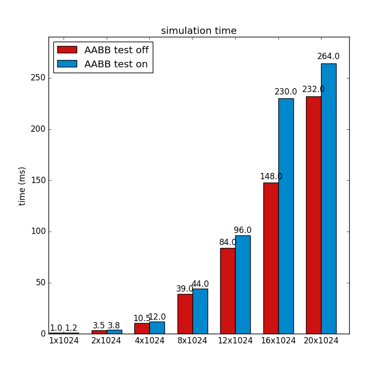

Vulkan Flocking: compute and shading in one pipeline!
======================

**University of Pennsylvania, CIS 565: GPU Programming and Architecture, Project 6**

* Rony Edde (redde)
  Windows 10, i7-6700k @ 4.00GHz 64GB, GTX 980M 8GB (Personal Laptop)

  *   

* This is a 2D flocking engine using Vulkan.

* Vulkan expects explicit descriptors because it's optimized in such a way that the commands expect a framework with a certain ordering of variables and layout locations.

* Multiple descriptor sets can be used for different stages of a pipeline, such as post processing, compute or additional processes.

* Increasing the number of Vulkan queues can create a bottleneck.  The simple reason is synchronization between queues which can be locking.  When multi threadding queues, the more granular the queues, the more synchronization is needed for dependent queues. Queues of the same family should reduce the bottlneck that queues from different families could have.  There are however specialized vender specific dedicated transfer queues that can also be used and are worth trying out.

* Compute commands can be very powerful when they can share data with a rendering pipeline.  Data transfer is usually a bottleneck, but once the data is shared, it's redily accessible which removes the delays introduced when accessing and overiding the data using standard copying.

* Performance.
  * Performance wize, without optimization, increasing the number of boids dramatically reduces performance.  Attempting to use an AABB calculation seems to lead to poorer performance.  This is possibly due to the additional checks for every boid.  An improvement that would be more beneficial if computed prior to sending all the boids to the compute shader.  Here are the results:  
  *   

### Credits

* [Vulkan examples and demos](https://github.com/SaschaWillems/Vulkan) by [@SaschaWillems](https://github.com/SaschaWillems)
